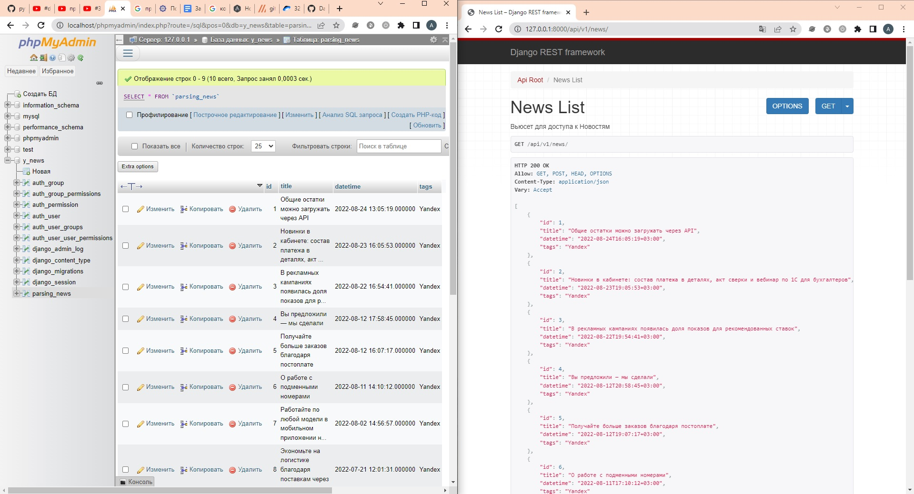

## Тестовое Задание  
1. Парсинг Я-Новости (Озон с js скриптами не осилил, пробовал scrapy/BS и даже selenium - не вышло)<br>
2. Импорт спарсенных данных (отдельным скриптом)<br>
*после того как развернул Джанго-проект со всеми зависимостями и провел миграции<br>
3. Написал простенький API на DRF для запросов <br>
НО Не успел оформить красивую админку в формате **AdminLTE3**<br>
Ну и в фелом красоту не успел навести 

## Стек технологий
 
 

 
 
 

## Как запустить проект
Клонировать репозиторий и перейти в него в командной строке:
```
git clone https://github.com/alvaresShD/api_yamdb.git
```

Перейти в папку с проектом
```
cd spider
```

Cоздать и активировать виртуальное окружение:<br>
*команды исходя из ОС Windows
```
python -m venv venv
source venv/scripts/activate
```

Обновить "pip" и Установить зависимости из файла requirements.txt:
```
python -m pip install --upgrade pip
pip install -r requirements.txt
```

Выполнить миграции:
```
python manage.py makemigrations
python manage.py migrate
```

Зайти в папку и запустить скрипт. к произведет импорт спарсенных данных в БД MySQL<br>
*перед этим я создал пустую БД с настройками под Джанго-проект в интерфейсе *phpmyadmin* 
```
cd /YM_news 
python3 import_to_MySQL.py
```

Запустить проект:
```
python manage.py runserver
```

Дадее можно перейти по запросам API
И если все робит, то должна получиться такая картинка
